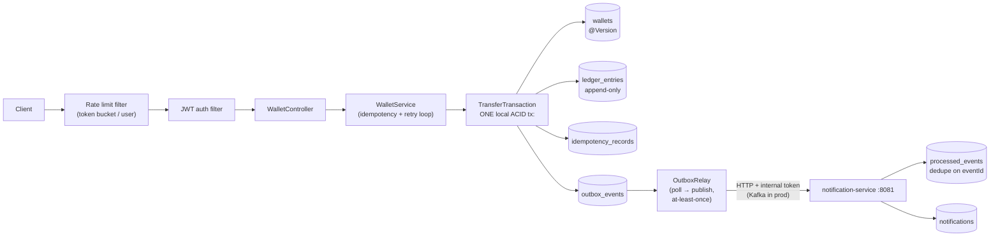

# PayFlow 💸

[](https://github.com/patil2001/payflow/actions/workflows/ci.yml)

A digital wallet & payments backend built with **Java 21 + Spring Boot 3** — designed to demonstrate the backend skills FAANG/product companies test at SDE-2 level.

## Why this project

Moving money is the hardest simple-sounding problem in backend engineering. This service handles the four failure modes every payments interview probes:

| Problem | Solution here |
|---|---|
| Two concurrent transfers corrupt a balance (lost update) | **Optimistic locking** (`@Version`) + bounded retry |
| Client retries a timed-out request → double spend | **Idempotency keys** with unique constraint + stored response replay |
| "Save to DB and publish to Kafka" crashes in between (dual write) | **Transactional outbox** + polling relay |
| Balance corruption is silent and unauditable | **Append-only double-entry ledger** — all entries net to zero |

## Architecture — two microservices



**payflow** (`:8080`) owns wallets, ledger, transfers. **notification-service** (`:8081`) consumes `TRANSFER_COMPLETED` events and records per-user notifications. Each service has its **own database** — no shared tables, communication only via events.

### The end-to-end reliability chain (the microservices interview answer)
1. Transfer commits balance change + outbox event in **one local transaction** (no dual write).
2. Relay delivers with **at-least-once** semantics — a crash between publish and mark-published means redelivery.
3. Consumer is **idempotent** — unique constraint on `eventId` in `processed_events` makes redelivery a no-op.
4. Net effect: **exactly-once processing** built from at-least-once delivery + dedupe — the same recipe as Kafka + idempotent consumers.
5. notification-service down? Events queue up unpublished and drain when it returns — graceful degradation, no data loss.

## Key design decisions (interview talking points)

1. **Money as `long` minor units** — never `double`/`float` for currency; `BigDecimal` acceptable, integers fastest and exact.
2. **Optimistic > pessimistic locking here** — transfers on the same wallet are rare (low contention); optimistic locking avoids holding row locks across the transaction. Under high contention (flash sale wallet) you'd flip to `SELECT ... FOR UPDATE`.
3. **Retry loop lives outside the `@Transactional` method** — in a separate bean, because `this.method()` self-invocation bypasses the Spring proxy and would retry inside the same doomed transaction.
4. **Idempotency enforced by a DB unique constraint**, not an in-memory check — the constraint is the only thing that survives a race between two concurrent duplicates.
5. **Outbox in the same transaction as the balance change** — event publish becomes atomic-with-commit; the relay gives at-least-once delivery, so consumers dedupe.
6. **Stateless JWT** — horizontal scaling without a session store; tradeoff (revocation) mitigated by short expiry.
7. **Cache-aside for balance reads** (Caffeine locally; Redis in a multi-node deployment), evicted on writes.
8. `open-in-view: false`, constructor injection everywhere, global error handling via `@RestControllerAdvice`.

## Run it

```bash
# prerequisites: JDK 21, Maven
# terminal 1 — notification service
cd notification-service && mvn spring-boot:run
# terminal 2 — payflow
mvn spring-boot:run
```
(payflow also runs standalone: set `payflow.events.webhook-enabled=false` and events are logged instead.)

```bash
# 1. Register two users (each gets ₹1000 opening balance)
curl -s -X POST localhost:8080/api/auth/register -H "Content-Type: application/json" \
  -d '{"email":"alice@x.com","password":"password1"}'
# → {"token":"..."}   (repeat for bob@x.com; note the tokens)

# 2. Transfer ₹50 (5000 paise) from alice to bob — Idempotency-Key required
curl -s -X POST localhost:8080/api/wallet/transfer \
  -H "Authorization: Bearer $ALICE_TOKEN" \
  -H "Idempotency-Key: demo-key-1" \
  -H "Content-Type: application/json" \
  -d '{"toUserId":2,"amountMinor":5000}'

# 3. Retry the SAME request — same transferId back, replayed=true, no double spend
# 4. Check balance & statement
curl -s localhost:8080/api/wallet/balance -H "Authorization: Bearer $ALICE_TOKEN"
curl -s localhost:8080/api/wallet/statement -H "Authorization: Bearer $ALICE_TOKEN"

# Hammer any endpoint 25x quickly → 429 rate_limit_exceeded
```

## Tests — the proof

```bash
mvn test
```

`WalletServiceConcurrencyTest` demonstrates the invariants:
- **10 threads transferring simultaneously** → no lost updates, money conserved exactly
- **Same idempotency key twice** → one debit, replayed response
- **Insufficient funds** → full rollback, nothing partial
- **Ledger always nets to zero** — the double-entry invariant

## Scaling story (say this when asked "how would you scale it?")

- Stateless app → horizontal scale behind an LB; JWT means no sticky sessions.
- H2 → Postgres; read replicas for statements; **shard wallets by userId hash** when writes outgrow one primary.
- Caffeine → Redis for shared cache + distributed rate limiting (Lua token bucket).
- Outbox relay → Debezium CDC into Kafka; consumers (notifications, analytics, fraud) scale independently.
- Hot wallet problem (one merchant receiving 1000 TPS): split into sub-wallet shards, sum on read.

## Tech

Java 21 · Spring Boot 3.3 (Web, Data JPA, Security, Validation, Cache, Actuator) · H2 · Caffeine · JJWT · JUnit 5
